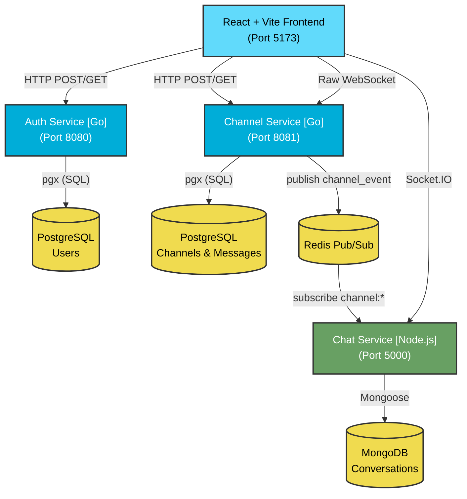

# Polyglot Microservice Architecture (v2)

This document provides a deep, interview-ready explanation of the microservice architecture driving the Polyglot Chat Application. 

We have transitioned from a Node.js monolith into a true distributed system utilizing **Go** for high-performance concurrent tasks (like WebSocket broadcasting and cryptography) and **Node.js** for specialized real-time messaging using Socket.IO.

---

## 1. Architectural Philosophy

The core architectural pattern used here is the **Polyglot Microservice Architecture**. 
It follows these strict microservice principles:

1.  **Independent Deployability**: Every service is a separate binary/process running on its own port.
2.  **Database per Service**: Services do not share databases. Go owns PostgreSQL; Node owns MongoDB.
3.  **Stateless Communication**: Services do not explicitly query each other via HTTP for user data. Identity is proven via cryptographically verified JWTs.
4.  **Event-Driven Reactions**: When a state changes in Go that Node needs to know about, it is broadcasted asynchronously via Redis Pub/Sub.

---

## 2. Line Architecture Diagram

Here is a high-level view showing the exact paths and protocols each component uses to communicate:

---

## 3. The Three Microservices

### A. Auth Service (Go - Port 8080)
**Role:** The Identity Provider.
**Responsibilities:**
- Handles `POST /auth/register` and `POST /auth/login`.
- Manages the `users` table in PostgreSQL.
- Hashes passwords using `bcrypt`.
- **Issues JWTs** signed with `JWT_SECRET` containing the user's `id` and `name`.

### B. Channel Service (Go - Port 8081)
**Role:** The High-Concurrency Broadcast Engine.
**Responsibilities:**
- Manages group channels, membership, and channel message history in PostgreSQL.
- Maintains thousands of raw **WebSockets** concurrently using Go's lightweight goroutines.
- Each channel runs as its own isolated goroutine "Hub", ensuring one active channel's traffic never blocks another.
- Publishes channel events (`channel_message`) to Redis for the rest of the ecosystem to react to.

### C. Chat Service (Node.js - Port 5000)
**Role:** The Direct Messaging & Media Handler.
**Responsibilities:**
- Maintains 1-on-1 Direct Messaging (DMs) using **Socket.IO**.
- Manages online presence (who is currently online) by writing Socket.IO connections to Redis (`online:<userId>`).
- Subscribes to Redis Pub/Sub to listen for channel events fired by Go.
- Handles `multipart/form-data` uploads via Multer.
- Stores DM history in MongoDB (`conversations` collection).

---

## 4. The "Database Per Service" Strategy

A major anti-pattern in microservices is the "Shared Database" (where multiple services read/write to the exact same SQL tables). We avoid this entirely.

*   **Auth Service & Channel Service** share a **PostgreSQL** instance, but logically govern distinct tables. Auth owns `users`, Channels owns `channels`, `channel_members`, and `channel_messages`. 
*   **Chat Service** owns a completely separate **MongoDB** database. 

**"Wait, how does Node know who the user is without querying Postgres?"**
This is solved by the **JWT**. When the frontend talks to Node, it sends the JWT. Node verifies the math behind the JWT signature using the shared `JWT_SECRET`. Because Node trusts the math, it pulls the `id` and `name` directly from the token payload. Node *never* needs to execute a `SELECT * FROM users` query.

---

## 5. Communication Patterns

### Client ➔ Service (API Gateway Pattern)
Currently, React acts as a smart client, routing traffic directly to the correct port based on the domain:
- Auth actions ➔ `:8080`
- Channel actions ➔ `:8081`
- DMs & Media ➔ `:5000`
*(In a production environment, this would be fronted by an Nginx API Gateway listening on port 80 or 443).*

### Service ➔ Service (Asynchronous Event-Driven)
Because Go uses WebSockets and Node uses Socket.IO, they cannot talk to each other directly. We bridge this gap using **Redis Pub/Sub** (Publish/Subscribe).

**The exact flow of an event:**
1.  **Frontend** sends `{"body": "Hello!"}` via WebSocket to **Go Channel Service**.
2.  **Go** saves the message to PostgreSQL.
3.  **Go** broadcasts the message to other WebSockets in the same channel.
4.  **Go** fires an event into the void: `redis.Publish("channel:123", messageData)`.
5.  **Node**, which ran `redis.Subscribe("channel:*")` on boot, immediately hears this event.
6.  **Node** formats the notification and emits it down its Socket.IO pipes to the relevant users.

This is a **fire-and-forget** architecture. Go doesn't care if Node process is dead or alive, it just publishes the event. This allows both systems to scale completely independently.

---

## 6. Request Lifecycles (Interview Examples)

### Scenario 1: User Logs In
1. React sends credentials to `auth-service` (Go) `:8080`.
2. Go hashes password, verifies against Postgres.
3. Go generates JWT, returns to React.

### Scenario 2: User Connects to Chat
1. React takes the JWT, decodes `id` and `name`.
2. React connects to `chat-service` (Node) `:5000` via Socket.IO emitting `login_me`.
3. Node writes `{ id, name, socketId }` to Redis with a TTL. Now the user is "Online globally".

### Scenario 3: User Joins a Channel
1. React sends POST to `channel-service` (Go) `:8081` with JWT in Authorization header.
2. Go verifies JWT, checks PostgreSQL if user is allowed in the channel.
3. Go upgrades HTTP request to a raw WebSocket.
4. Go registers the WebSocket inside the channel's specific Goroutine Hub.

---

## 7. Why This Architecture Scores High in Interviews

If asked "Why did you build it this way?" in a system design interview, here is the justification:
*   **"I picked Go for the Channel Service because of goroutines."** WebSockets require holding thousands of idle connections open. Node uses an event loop which is good, but Go provisions a lightweight goroutine per connection (~2KB memory). It is fundamentally more efficient for raw massive-scale broadcasting.
*   **"I kept Node.js for DMs because of the Socket.IO ecosystem."** Socket.IO handles automatic reconnections, fallbacks to long-polling, and media uploads exceptionally well in the Node ecosystem.
*   **"I used Redis Pub/Sub to enforce decoupled bounds."** The services don't know about each other's codebases. They only agree on the schema of the JSON events passing through Redis.
*   **"I implemented Stateless JWT Auth to prevent database bottlenecks."** By not having a shared session database, we saved milliseconds on every request. Services independently math-verify tokens.
